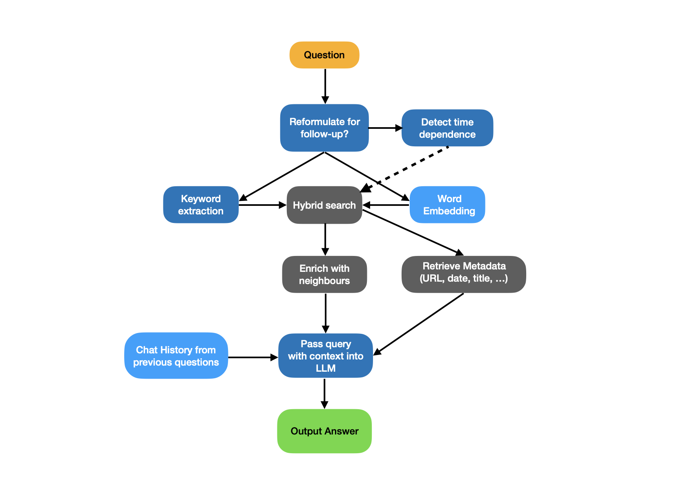
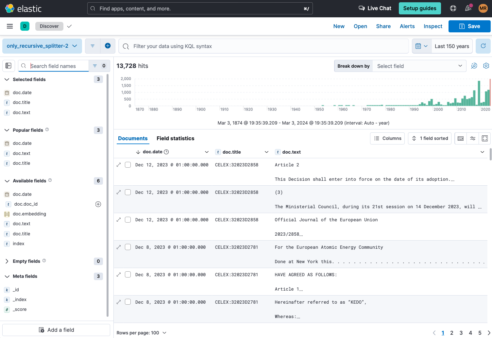
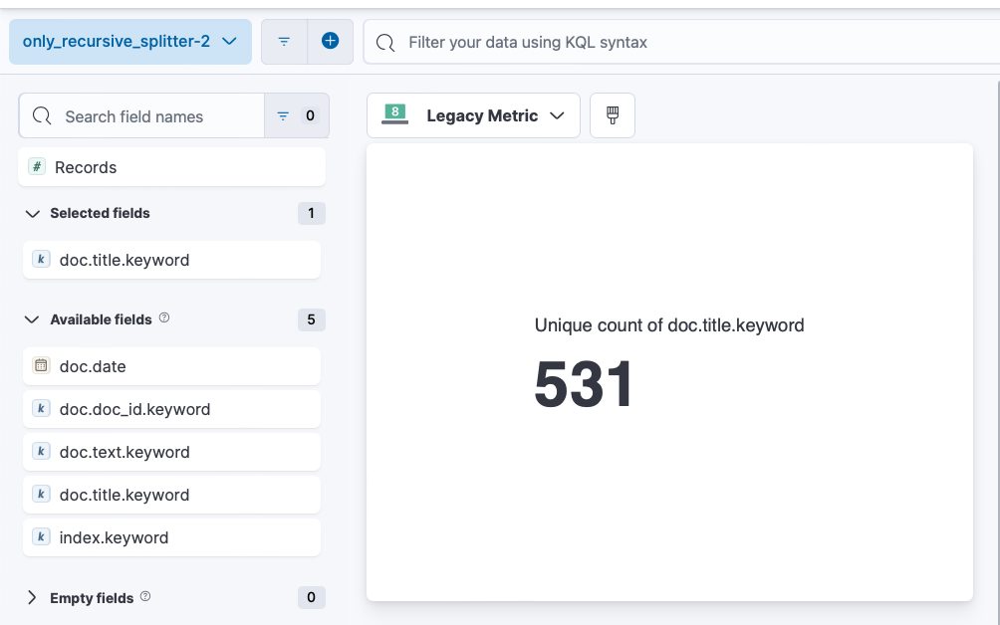
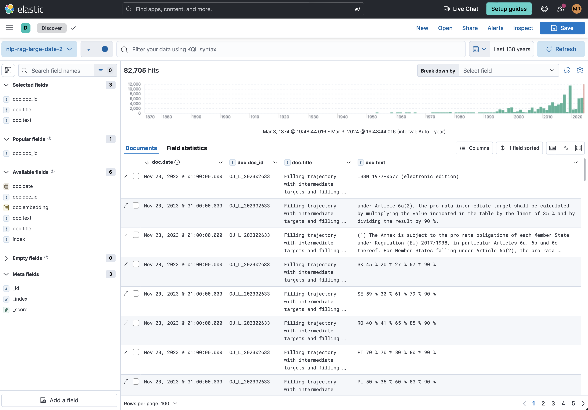
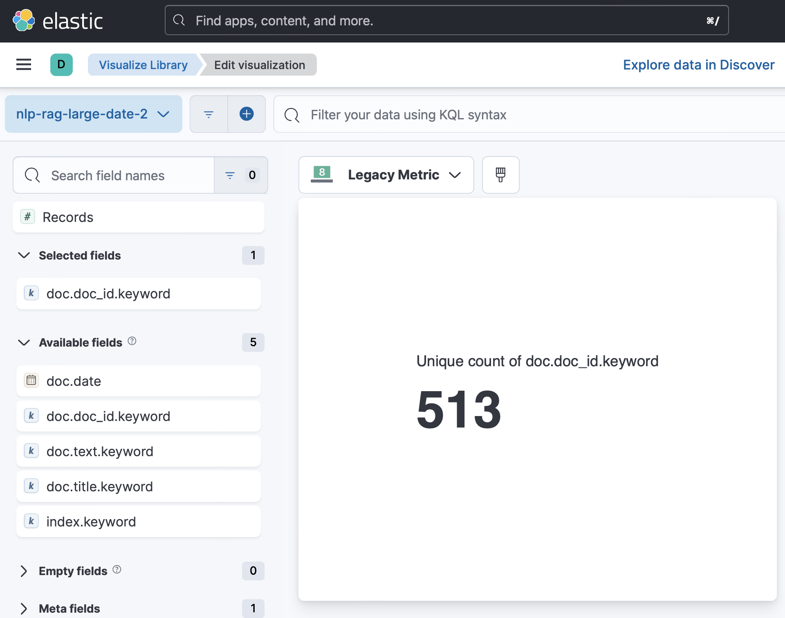
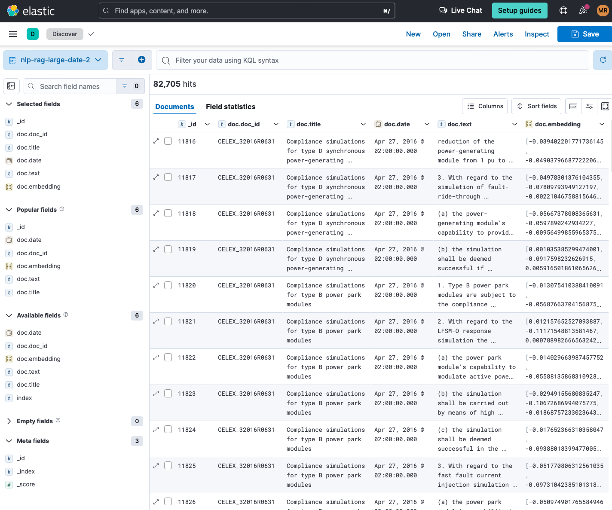
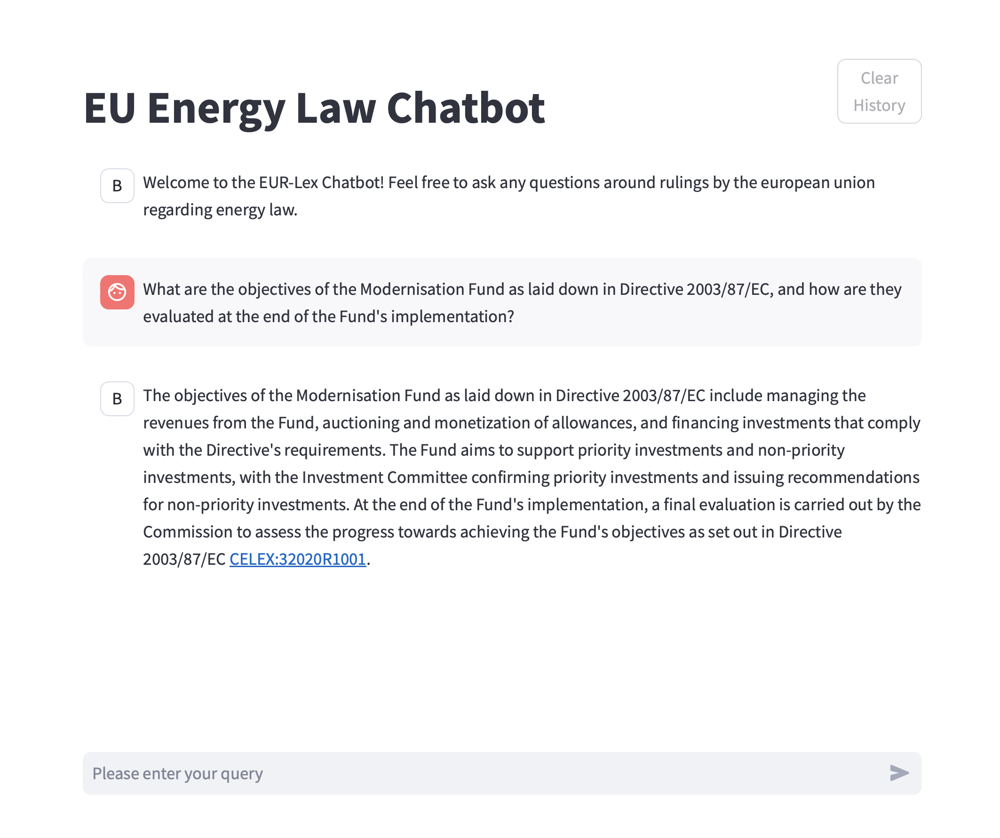
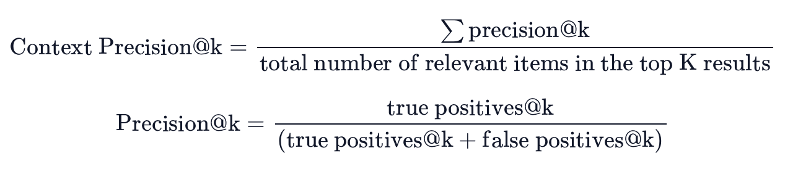
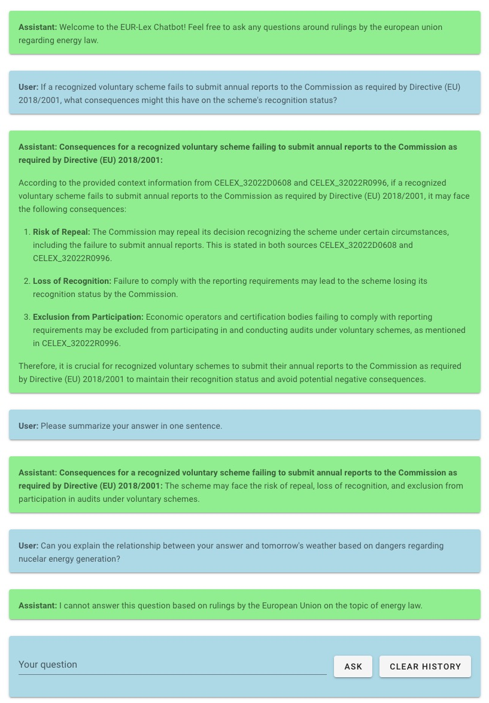
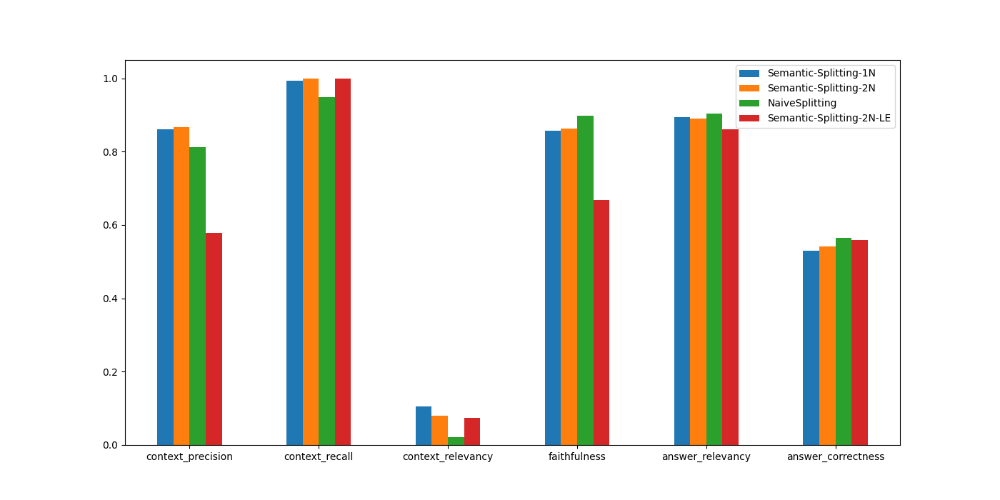

# Natural Language Processing using Trandsformers: Final Project Report

## Key Information
Project Title: Question Answering System for Rulings of the European Union on Energy Law

Project Participants (Group 26):
- Immanuel Sulzer, Study: Bachelor of Science Physics
- Maximilian R., Study: Master of Science Physics

## Introduction

Due to the ever-increasing amount of data and knowledge about many different domains stored in different types of databases and accessible through the internet, it becomes increasingly important to have efficient means of retriving and combining data.
Researchers in the field of computer science have worked on Question Answering systems for > 70 years.
Early systems developed in the 1960s and 1970s have successfully demonstrated their ability to answer questions posed by human users about narrow domain knowledge.

In 1961, a system called "Baseball" was one of the first to provide automatic question-answering to users providing them with its knowledge about baseball games [[Green, Bert F. et al]](#Baseball).

In 1972, a similar system was created for providing information to lunar geologists, presenting "considerable progress towards the ultimate goal of providing a general purpose natural
language interface between men and machines" [[Woods, W. A. (1977)]](#Lunar).

Since the early attempts at developing question answer systems, there have been revolutionary developments on multiple domains involved in building such systems.

One notable advancement is the development of Large Language Models like GPT-3.5 and GPT-4 by OpenAI [[OpenAI(2023)]](#GPTPaper). These models allow retrieving information and generating answers from large amounts of text data.

The improvements in the performance of Large Language Models were enabled by ever-growing number of parameters used in their architecture. This means that training and executing them became increasingly expensive, time-consuming and requires specialized hardware. OpenAI's GPT-3.5 has around 175 billion parameters, which means it cannot be executed on consumer hardware and requires multiple expensive GPUs, which means that those models can only be run inside of hosted environments which usually work on a pay-per-use basis.

As part of the lecture "Natural Language Processing using Transformers" held by Prof. Gertz in the University of Heidelberg, we have been given the opportunity to develop a question answering system using Large Language Models to answer a wide range of questions about European Legislation on Energy Law.

Due to the time, cost and infrastructure-constraints encountered in a university project setting, we decided to build a Retrieval-Augmented Generation System which does not require trainig a large language model from scratch.

Our project demonstrates that one can build a relativly accurate and competent question-answering system by using commonly available tools and libraries, without the need for expensive hardware or long training times.

## Methods / Approach

### Data acquisition
The Retrieval-Augmented Generation system requires a database which needs to be filled with the documents based on which the questions given as input should be answered by the Large Language Model.

These documents need to be collected from some source and converted into a format suitable for storage inside the vector / text database.

In our case, the data comes from the EUR-Lex website on which the european union which grants access to rulings, in our case specifically rulings related to the topic of energy.

On this website, one can then find a list of documents that are available in different formats like PDF and HTML.

These documents need to then be converted into plain text, as our storage system can only store text and not any other sorts of data like images. This is done using common available libraries for reading HTML or PDF documents.

For our project, we use the [beautifulsoup](https://pypi.org/project/beautifulsoup4/) python library for reading the search page on EUR-Lex and collecting the list of document that we need to scrape.

We evaluated two different approache for the scraping of the documents.
Approach (a) downloads the PDF version of each document and inputs it into the [UnstructuredPDFLoader](https://api.python.langchain.com/en/latest/document_loaders/langchain_community.document_loaders.pdf.UnstructuredPDFLoader.html) provided in the langchain library. This loader reads PDF documents and converts them into plain text.

Approach (b) uses the HTML versions of each document. They are read and interpreted using [beautifulsoup](https://pypi.org/project/beautifulsoup4/). Due to using the HTML version, it is possible to read the structure of the document, e.g. discerning wether a given part of the document is a title, header, section name or regular content.

### Data pre-processing and upload
Important aspects of the data processing pipeline are text splitting, context enrichment and word embedding.

Text splitting is used to split up larger documents into smaller chunks. Reasons for this can be that documents are too large to be stored at once inside the database.
Additionally, search can be inefficient if it is performed on large documents when only small excerpts would be relevant for answering a question.
To split the documents into smaller chunks, one can use different approaches. This includes splitting based only on the number of chunks (e.g. dividing a document into a number of chunks with equal length).
One can also propose more intelligent chunking, for example based on the structure of the document (separating different sections of a document into different chunks).
We attempted and evaluated both of these approaches during our experiments.

For performing splitting without semantic awareness, we used the [RecursiveCharacterTextSplitter](https://api.python.langchain.com/en/latest/text_splitter/langchain.text_splitter.RecursiveCharacterTextSplitter.html) provided by the langchain python library which splits documents into equal-length chunks with a given overlap. The advantage of this approach is its easy to implement and that it definetely incudes every relevant bit of text from the documents, at the expense of preserving only little structure.
For the second approach, we used a combination of the [beautifulsoup](https://pypi.org/project/beautifulsoup4/) python library for navigating and understanding the structure of the HTML document, together with the same langchain [RecursiveCharacterTextSplitter](https://api.python.langchain.com/en/latest/text_splitter/langchain.text_splitter.RecursiveCharacterTextSplitter.html) to split the text in a given semantic section. This approach can separate different paragraphs and separate things like titles and headers from the text and store them separately as metadata to preserve part of the document structure.
In both cases, the resulting splits were done while keeping some overlap, to avoid losing information from splitting sentences.

Context enrichment attaches further information to the individual documents stored inside the database.
This can include metadata of the documents, e.g. the title, author or date of a document.
Additionally, one can perform further enhancement, like providing a summary of the document to each part of it stored inside the database. It has also been proposed to attach possible questions generated for a given text chunk to the chunk itself, as this can improve query performance.

For our system, we needed to extract the date information for the EUR-Lex documents. This was done by using a prompt to ChatGPT to extract the date information out of the beginning of each document.
This did not work for all documents, so we had to manually fill in this information for some.
Additionally, in the context-aware splitting approach, we detected the title of each section of a document from which a text snippet was persisted and saved this as additional metadata.
Finally, we added the CELEX-ID of each document as metadata so the documents could be searched and quoted by their identifier.

To enable semantic search, the documents need to be embedded using vector embeddings.
The vectors are then stored alongside the document itself, which enables to perform hybrid-search which combines literal search (searching for the actual characters / words) with semantic search (searching for nearest neighbours in the k-dimensional embedding vector space).

We used two different embedding models, namely the smaller [sentence-transformers/all-MiniLM-L6-v2](https://huggingface.co/sentence-transformers/all-MiniLM-L6-v2) and the larger [sentence-transformers/all-mpnet-base-v2](https://huggingface.co/sentence-transformers/all-mpnet-base-v2).

### RAG pipeline
The Retrieval Augmented Generation (RAG) pipeline is in its basic structure similar to the system described by [[Lewis et al.]](#Lewis) in his original paper on retrieval augmented generation. It consists of a query encoder, a vector database outfitted with some similarity metric and a language model to formulate an answer from the retrieved information.

Structural representation of the RAG workflow in this project

#### Query encoder

The query encoder's job is to embed some text query into a vectorspace with some semantic meaning. This embedding can then be used together with a similarity metric to search a vector database of similarly embedded texts to extract sematically similar documents from a document corpus. The first encoding model used for this project is the [`sentence-transformers/all-MiniLM-L6-v2`](https://huggingface.co/sentence-transformers/all-MiniLM-L6-v2) model, which is a small, high performance embedding model that embeds text queries into a 384 dimensional vector space. A second one we evaluated was the [sentence-transformers/all-mpnet-base-v2](https://huggingface.co/sentence-transformers/all-mpnet-base-v2) with output dimension 786. The advantage of both small models is that they can easily be run on regular consumer hardware such as a laptop, which removes the need for a GPU or potentially costly API call to get the embeddings of a query.

#### Vector Database

The job of the vector database is to recieve an embedding of a query and then use a similarity metric to determine the closest documents of its contents. It should also be able to store additional information such as for example the plain text of the document embeddings, the titles of the documents and additional, useful metadata. For this project we opted to use [elasticsearch](https://www.elastic.co/elasticsearch), because it offers a variety of useful functionalities such as built in vector storage with built in similarity metrics and hybrid search, an easy to use python API, the option for server side storage, a comprehensive online data explorer and an extensive free trial version.

#### Language model

The language model is perhaps the most essential part of the RAG pipeline, because it turns a collection of unstructured, potentially relevant context into a comprehensive and accurate answer for the end user. While there are many flavors and sizes of large language models, in this project we have included and experimented with two different models: The chat fine tuned 13 billion parameter version of open source [Llama2](https://llama.meta.com/llama2) model created by Meta and OpenAI's [ChatGPT 3.5](https://openai.com/blog/chatgpt). The advantage of using an open source model such as the Llama2 model is that there are many different implemetations of it available. For our project, we used and integrated the [Huggingface implementation](https://huggingface.co/meta-llama/Llama-2-13b-chat-hf) to run the model on GPU and the [Ollama](https://github.com/ollama/ollama) implementation, which provides optimized models to run on whatever hardware available. As opposed to the Llama implementation, the usage of ChatGPT requires using the paid OpenAI API, but due to the much larger model size together with cloud computing this offers larger context windows and generally better performance, both in terms of quality as well as speed.

For the final implementation, we opted to use ChatGPT as the performance, especially for the pipeline steps like date extraction and keyword extraction was much better.

#### Pipeline

Our RAG pipeline combines the three building blocks that the encoder, the database and the language model into a single application together with some additional functionalities. The individual steps are described in the following paragraphs.

##### Follow up questions

When the user enters a question, the first step is to check, whether this is the beginning of a new conversation or if a question has been asked before. If a question has been asked before, the language model embedded into the pipeline is given the two questions and asked to determine, whether the two questions stand in any kind of logical relationship, specifically, whether the second question is a follow up question to the first question. If there is such a relation between the two questions, the language model will reformulate the second question in such a way, that it can be understood as a standalone question.

As an example, assume the first question asked by a user is _"Was the 'Better Biomass' voluntary scheme assessed by the Commission for recognition under Directive (EU) 2018/2001?"_, the model will give a positive answer. A natural follow up question might be _"Why did that happen?"_, which is will probably not yield any useful search results when embedded and queried against tha database. This is because the second question contains no useful information regarding the topic of the first question, so both a semantic and literal search based on the question _"Why did that happen?"_ is going to return unrelated documents. In contrast, a language model can rephrase this question in the context of the first question to something like _"Why did the 'Better Biomass' voluntary scheme get assessed by the Commission for recognition under Directive (EU) 2018/2001?"_ contains all the information from the first question inside the sematic context of the **why** from the second question, so it is much more likely to yield useful results in a semantic or hybrid search.

The idea to rephrase the query to improve follow up questions is a special case of **Query Rewriting**, which generally means improving a query by prompting a large language model to reformulate or add to it in some way. This concept is explored in more depth by for example [[Ma et al.]](#Ma) in their paper _Query Rewriting for Retrieval-Augmented Large Language Models_.

##### Time filtering

Another building block of the RAG pipeline is the the ability to detect timeframes for the source information to come from. Because the documents span from 1953 to 2023, there might be some outdated regulations in the documents that have been repealed or altered since their original publication. Furhtermore, users might be interested to recieve information that was published before, after or during a certain time. To enable this sort of time dependent filtering, the language model is asked to determine whether the question is phrased in such a way that the information that answers it correctly was released during a specific time frame. Notably, the model is quite adept at differentiating between the difference between the time dependence of the publication of the information and the time dependence of the content of the information. For example, the question _"What are the requirements for storage cabinets published in 2010?"_ is clearly answered only by articles published in 2010. Conversely, the question _"What is the target for carbon emissions in the EU in 2030?"_ pertains to a certain time as well, but the retrieved documents should not be filtered by that time.

##### Keyword extraction

In order to improve the literal search part of the hybrid search, the essential keywords from a question are extracted. This has the advantage that it removes filler and connector words, which add little to no benefit to the literal search in the case of fuzzy matching. Additionally, one or two new keywords that are synonyms or very closely related may be generated, such that the literal search is more likely to include documents of relevance to the questions but have a different phrasing.

This task of keyword extraction and addition is also performed by the language model, which is prompted to return a list of keywords satisfying the conditions described above.

##### Hybrid search

After the previous preprocessing steps, the potentially reformulated query is embedded by the embedding model and used, together with the extracted keywords, in a potentially date filtered hybrid search against the database to retrieve the most relevant context documents.

Hybrid search combines the two retrieval methods of literal search and semantic search by executing them separately and the merging the results of both. The semantic search performs a k-nearest-neighbor search using **cosine similarity** as a distance metric. The cosine similarity simply corresponds to the normalized dot product between two embedding vectors

$$\text{cosine similarity} = \frac{\textbf{A}\cdot\textbf{B}}{\|\textbf{A}\|\|\textbf{B}\|}$$

This yields a correlation metric that ranges from $-1$ to $1$ which corresponds to negative or positive correlation, with the magnitude determining the amount of (positive or negative) correlation.

The merging of the results from the two kinds of searches is done via **Reciprocal Rank fusion** ([[Cormack et al.]](#Cormack)). Reciprocal rank fusion ranks $D$ documents $d$ with a rank $r(d)$ by calculating the rank score

$$\text{RRFscore}(d)=\sum_{r\in R}\frac{1}{k + r(d)}$$

with some experimental constant $k$. This rank score can then be used to jointly rank the search results of the semantic and similarity searches to determine the relevance of the retrieved documents.

##### Context enrichment

After the database has been queried and the ranked documents returned, it can be useful to enrich the context by adding one or two of the neighboring chunks of text. Depending on the data preprocessing and the chunking size, many of the text chunks in the database may only be about one or two senteces long (perhaps even shorter!). This is very useful, because shorter chunks are less likely to contain several different pieces of information that potentially interfer with each other during the search, but it also means that the actually retrieved chunks contain less information overall. Since related information often appears together in texts, it can help to enrich the retrieved text by simply adding the contents of one or two adjacent chunks. In the worst case this adds irrelevant information to the context that can be ignored during the formulation of the answer, and in the best case it adds vital information or qualifications to the information that can be relevant to the answer.

Additionally, metadata like URLs, document dates or titles is retrieved together with the document texts to allow for referencing of URLs, titles or dates and help put the information into context.

##### Answer formulation

The final step of the RAG pipeline is to use the language model to join all of the carefully collected information into a comprehensive answer. The language model can be encouraged to pay closer attention to different aspects of the context or the question or it can be instructed to format the answer a certain way. Additionally, we included the previous chat history and parts of the prevously retrieved context to give the system a sort of "memory" and enable it to understand references to previously asked questions.

##### Restriction to domain of expertise

As pre-trained Large Language Models are usually trained with a varied dataset consisting of all sorts of documents, the prompt to the LLM in a RAG use-case needs to be given in a way that the LLM does not respond to questions that are outside of its region of expertise.

For this, we added a instruction in our prompt to not give answers if out-of-expertise questions arise.

## Experimental Setup and Results

### Data

We scraped the EUR-Lex database with our two approaches explained in the methods-section.
For the approach (a) based on using the documents in PDF form and reading them via the UnstructuredPDFLoader and splitting only via the RecursiveTextSplitter, there are 13.728 chunks from 531 unique documents.

Overview of the data for the splitting based only on the RecursiveTextSplitter

Count of unique documents for the splitting based only on the RecursiveTextSplitter

For the approach (b) using the HTML versions of the documents, reading them via custom implementation with beautifulsoup and splitting each semantic entity via the RecursiveTextSplitter, there are 82.705 chunks from 513 unique documents.

Overview of the data for the splitting based only on the RecursiveTextSplitter

Count of unique documents for the splitting based only on the RecursiveTextSplitter

The difference in the count of unique documents can be attributed to the different times when the scrapers were executed, as there were some rulings added in December of 2023, which were included in the approach (a) but not in approach (b).

In general, the following attributes were stored in elasticsearch:

<table align="center">
<thead>
  <tr align="center">
    <th>Field</th>
    <th>Meaning</th>
    <th>Source</th>
  </tr>
</thead>
<tbody>
  <tr align="center">
    <td>_id</td>
    <td>unique id of text chunk</td>
    <td>generated</td>
  </tr>
  <tr align="center">
    <td>doc_id</td>
    <td>CELEX ID of document</td>
    <td>read during scraping</td>
  </tr>
  <tr align="center">
    <td>title</td>
    <td>title of subsection which contains text chunk</td>
    <td>extracted during scraping via HTML structure</td>
  </tr>
  <tr align="center">
    <td>date</td>
    <td>date of document</td>
    <td>extracted via LLM during scraping</td>
  </tr>
  <tr align="center">
    <td>text</td>
    <td>text for chunk</td>
    <td>extracted during scraping</td>
  </tr>
  <tr align="center">
    <td>embedding</td>
    <td>embedding vector of text chunk</td>
    <td>calculated during scraping using embedding model</td>
  </tr>
</tbody>
</table>

Details about document attributes

Document attributes inside Elastisearch

### User Interface

To interact with our system, we created two different user interfaces.

The first UI was created using the [solara](https://solara.dev) python library.
This has the benefit of being easily executable inside a Jupyter Notebook:

User Interface built using Solara and executed inside Jupyter Notebook

The second UI was created using the [Streamlit](https://streamlit.io) python library.
It has a better design and feel than the one created using Solara, but it cannot be executed inside a jupyter notebook.

Stand-Alone User Interface built using Streamlit

As a notable feature of both UIs, the LLM was prompted to deliver text in the Markdown text format, which means that the answer can be provided in a structured format, using lists or highlighting important parts in bold text.
Additionally, the sources are provided by their CELEX ID which - as can be seen in both screenshots - is in blue font and serves as a hyperlink to the respective document on the EUR-Lex website.

### Evaluation Methods

To evaluate our RAG system, we used both qualitative and quantitative methods.

Qualtative methods meant using the system in a conversational way and judging ourselves if the system performed to our expectation and if the answers were relevant, well-structured and equivalent to what was stated in the repective ruling documents.

As the "personal evaluation"-method does not quantify the performance of our system and does not really allow for a suitable evaluation of our system, we performed quantitative evaluation using the [[RAGAS]](#RAGAS) framework and corresponding python library.
This assessment framework was built on the realization that evaluating RAG-systems is multi-dimensional, namely the ability of the retrieval system to identify relevant and focused context passages, the ability of the LLM to exploit such passages in a faithful way, or the quality of the generation itself ([RAGAS Paper](#RAGAS)).
The frameworks provides a set of metrics which can measure the system's capability in the different dimensions.

Evaluating the system's capabilities includes the need for measuring semantic similarity. This is done by using an OpenAI embedding model.

The evaluation also includes processing and judging text, which in itself is a task for an LLM. Hence RAGAS uses an LLM to process and judge the questions, answers, ground-truths and context.

In order to use the RAGAS evaluation framework, we needed to generate a set of questions and ground-truth answers which could be used in the evaluation of our system. 
We generated questions by giving random documents into ChatGPT and asking it to generate a set of question and answer pairs for the documents.
To increase the variety of the questions, we asked ChatGPT to generate
- "Normal" questions, for example `What is the Union's binding domestic reduction target for net GHG emissions by 2030 according to the conclusions of the European Council of December 2020?`
- "Yes/No" questions, for example `Does Directive 2009/125/EC mandate the European Commission to establish ecodesign requirements for energy-related products?`
- "Hypothetical" questions, for example `Suppose a voluntary scheme recognized by the Commission undergoes significant structural changes that affect its compliance with sustainability criteria. How might these changes impact the scheme's recognition status under Directive (EU) 2018/2001?`
- "Complex" questions, for example `In what ways could the Euratom Programme encourage the participation of third countries while ensuring alignment with its objectives and maintaining a fair balance of contributions and benefits?`

Our collection of 40 questions can be found here: [text_questions_reduced.txt](https://github.com/Immi000/NLP_and_Transformers-INLPT-WS2023/blob/main/evaluation/text_questions_reduced.txt).

These are a subset of a larget collection of 239 question-answer pairs which can be found here: [text_questions.txt](https://github.com/Immi000/NLP_and_Transformers-INLPT-WS2023/blob/main/evaluation/text_questions.txt).

Since the evaluation with RAGAS required using OpenAI LLM and embedding models which had a relatively high cost, combined with the need for a large number of prompts to calculate the chosen metrics, we decided to use a manually selected subset of the original 239 questions as this would otherwise have lead to high costs for our evaluation runs.

### Experimental Details

For our evaluation, we used six of the metrics provided by the RAGAS framework. We performed four evaluation runs over our 40 test questions using different parameters. In all experiments the techniques outlined in the Methods section like improving follow up questions, detecting time dependence, extracting keywords and context enrichment were performed together with hybrid search.

- `Semantic-Splitting-1N` uses the semantic chunking database with a one-neighbor einrichment

- `Semantic-Splitting2N` uses  the semantic chunking database with a two-neighbor einrichment

- `NaiveSplitting` uses the naive chunking database  with a one-neighbor einrichment

- `Semantic-Splitting2N-LE` uses  the semantic chunking database with a two-neighbor einrichment, but with the alternate embedding model `all-mpnet-base-v2`, which uses an embedding dimension of 768 (twice the size of the embedding used in the other trials)

Note that we used three different database configurations for these experiments: One with the semantic chunking and 384 dimensional embeddings, one with the semantic chunking and 786 dimensional embeddings and one with the naive chunking and 384 dimensional embeddings.

During our trial runs, we used the RAGAS framework to determine six different scores to be able to compare our approaches. The definitions of the scores are taken from the [RAGAS documentation](https://docs.ragas.io/en/stable/concepts/metrics/index.html):

 - **context_precision** evaluates whether the documents that are actually relevant for the ground truth are ranked highly or not. The metric is calculated with the help of the precision@k score and the total number of contexts $k$
 

- **context_recall** measures how well the predicted answer matches the ground truth on a sentence by sentence basis. Each sentence in the ground truth is evaluated against the context and it is checked, whether the information in the sentence can be atributed to the ground truth. The recakk measure is then calculated by $\text{context recall}=\frac{\text{no. of GT sentences that can be attributed to context}}{\text{number of sentences in GT}}$

- **context_relevancy** measures whether the retrieved context is relevant to the question on a sentence by sentence basis. The context relevancy is calculated as $\text{context relevancy}=\frac{\text{number of relevant sentences}}{\text{number of total sentences in retrieved context}}$.

- **faithfulness** measures whether the generated answer is factually consistent with the retrieved context on a number of claims basis. The score is calculated as $\text{faithfulness}=\frac{\text{number of claims that can be inferred from context}}{\text{number of total claims}}$.

- **answer_relevance** measures how relevant a generated answer is given the question., penalizing incomplete answers or redundant information. This score is calculated by using an LLM to create appropriate questions to the given answer several times. The score is then calculated by measuring the cosine similarity between the generated questions and the original question.

- **answer_correctness** measures the factual accuracy of the generated answer compared to the ground truth. The score is calculated as a weighted average between the semantic (cosine) similarity between the generated answer and the ground truth and the F1 score, which is calculated as $\text{F1 score}=\frac{TP}{TP+0.5\cdot(FP+FN)}$ where $TP$, $FP$ and $FN$ stand for the number of true positive (facts present in both ground truth and answer), false positive (facts present in answer but not in the ground truth) and false negative (facts present in the ground truth but not the answer) statements.

Each of these scores ranges between zero and one, with a higher score indicating a better model.

### Results

During experiments with our system, we found it to produce well-structured and logical responses to our questions.
In most cases, the response matched that what we expected by reading through the scraped documents.
Additionally, the system reacts to follow-up questions and refrains from answering questions which are out of scope for the given task:

Example interaction with our system

As for the quantitative evaluation that we performed using the RAGAS evaluation framework, the following are the results for the selected metrics over 40 questions of varying types, evaluated for each of the 4 different configurations.

<table border="1" class="dataframe" align="center">
  <thead>
    <tr align="center">
      <th></th>
      <th>Semantic-Splitting-1N</th>
      <th>Semantic-Splitting-2N</th>
      <th>NaiveSplitting</th>
      <th>Semantic-Splitting-2N-LE</th>
    </tr>
  </thead>
  <tbody>
    <tr align="center">
      <th>context_precision</th>
      <td>0.860638</td>
      <td>0.866062</td>
      <td>0.813012</td>
      <td>0.578126</td>
    </tr>
    <tr align="center">
      <th>context_recall</th>
      <td>0.992593</td>
      <td>1.000000</td>
      <td>0.948718</td>
      <td>1.000000</td>
    </tr>
    <tr align="center">
      <th>context_relevancy</th>
      <td>0.104519</td>
      <td>0.079393</td>
      <td>0.022379</td>
      <td>0.073917</td>
    </tr>
    <tr align="center">
      <th>faithfulness</th>
      <td>0.857456</td>
      <td>0.863889</td>
      <td>0.897436</td>
      <td>0.668919</td>
    </tr>
    <tr align="center">
      <th>answer_relevancy</th>
      <td>0.893751</td>
      <td>0.891022</td>
      <td>0.903436</td>
      <td>0.860319</td>
    </tr>
    <tr align="center">
      <th>answer_correctness</th>
      <td>0.530062</td>
      <td>0.542053</td>
      <td>0.565605</td>
      <td>0.559757</td>
    </tr>
  </tbody>
</table>

Evaluation Results of the 4 different configurations

Bar Plot of the evaluation results

### Analysis

With all the evaluation metrics calculated by the RAGAS library, a higher value is better.

We observe that the NaiveSplitting performs worst on the three context-related metrics.
This makes sense as with the NaiveSplitting, one would expect to get on average less relevant context than with the other splitting methods. Since the context-related metrics penalize unrelated context information, it makes sense that the scores are worse.

Additionally, the NaiveSplitting did not have information about the title of the respective text section added to the document metadata. This might make it harder for the language model to contextualize the retrieved information, because section titles can convey important information about a text.

On the other hand, for the three metrics regarding the answer, namely the faithfulness, answer_relevancy and answer_correctness, the NaiveSplitting slightly outperformed the other chunking algorithms.

While the increased embedding size yielded good results in terms of answer correctness, context recall and context relevancy, it performed significantly worse in the remaining three metrics.

Generally, there is no clear "winner" between the different approaches. While the sematic splitting did improve the context-relevant metrics, this improvement did not translate into the quality of the answers. The increased embedding size yielded better context relevancy and answer correctness, but introduced defficits in context precision and faithfulness.

Additionally, there are two important qualifications to be made. Firstly, the RAGAS framework relies on a large language model with a nonzero temperature. This introduces quite some noise into the results, so the metrics as dispalyed above may not be very accurate. Due to the very heavy usage of the LLM (roughly 1.000.000 tokens per evaluation of our 40 questions), it was not possible for us to repeat evaluations several times or to include a larger number of test questions. As the tasks performed during the evaluation are quite challenging for the LLM, it was unfortunately not possible to use a locally run LLM like Llama 13b, because it was not able to complete the tasks required by RAGAS. Even with ChatGPT, some metrics were not computed correctly in a few cases, with e.g. factually correct answers closely matching the ground truth being assigned low accuracy scores.

Secondly, during manual experiments we discovered that even slightly altering a question can lead to vastly different qualities in answers, even with the LLM temperature set to zero. This is because the RAG pipeline depends on several, subsequent calls to the language model, as well as a semantic search against a large document corpus, so small changes add up over iterations and might slightly alter the retrived resuls, which can significantly change the final prompt and steer the model in a different direction.

Due to the ambiguity of the results, we have chosen to include access to three of the evaluated indices in the final project, namely the ones with the smaller embeddings, so that potential users can make up their own mind. Each of the four approaches has their own strenghts and shortcomings, so one might succed in provifing a satisfactory answer where another one fails and vice versa.

## Conclusions and Future Work

In relatively short time, and without the need for expensive hardware, we were able to build a system for question answering on the domain of rulings by the european union on energy law.

It proved to be able to successfully and effectively answer advanced, even hypothetical questions, about the rulings extracted from the EUR-Lex database.

However, we noticed, that without using a hosted LLM by OpenAI, we were not able to create a system which is able to perform on a satisfactory level, as the models that are Open Source and runnable inside a Google Colab environment were not sophisticated enough for our use-case, especially the use-case with regards to keyword and time detection.
Such processing steps rely heavily on the answer, e.g. the date range requested by the user, coming in a pre-defined and clear format. Less sophisticated models tended to deviate from our expected format, hence rendering the answer useless for the further processing. The intermediate processing steps like the keyword detection for the search would make the overall result largely dependent on finding the correct and relvant keywords from a given query, hence this underlies the requirement of reproducable and consistent answers given by the LLM.
Additionally, smaller languare models have a very limited input length, making it very difficult to pass all of the required context to a model, and makes it even difficult if the model is supposed to be able to see the prevous conversation.

Even with the more capaple ChatGPT 3.5, the system occasionally fails to either preprocess the prompt correctly or to answer the question correctly based on the context. Additionally, the hybrid search can fail when it returns documents where other documents relevant to the answer are referenced. For example, the question _"What are the energy requirements for refrigerated storage cabinets"_ will have a high chance of returning a document containing _"The regulations on energy requirements for refrigerated storage cabinets are outlined in XY"_, because it has a large keyword overlap and is semantically similar, even though the document adds little useful information apart from the reference. To be able to resolve such references dynamically, a much more sophisticated document preprocessing would have to be performed.

### Possible Improvements

The pre-processing of the answer can be further improved to allow for more complex queries.
Examples could be: "Summarize rulings about the requirements of refridgerated storage cabinets concluded before 1975 and not containing the term 'Energy efficiency'".
Such a query currently does not work with our system as the query interface only supports keyword search with the addition of restricting document date ranges.
One could implement the more advanced search by asking the LLM to create the Elasticsearch query payload from the search, hence allowing for chaining, "and/or" cominations, etc.

Additionally, one can further enhance the metadata attached to the documents by for adding a document summarization or example queries to the text chunks taken from the documents.
Especially for longer documents, this could enable the LLM to better understand the context out of which a given text chunk is taken.

Using a fine tuned language model could improve the formulation of answers and improve the stability of the system by giving the language model a better "intuition" for the type of answer required by the user.

Further improvement could be a processing step after the retrieval->answer generation step which would ask the LLM if it thinks that the answer is sufficient and the retrieved context is relevant to the question and generated answer.
If the LLM does not conclude that the context was sufficient or the answer is not good enough, one could send another query to the document database with adjusted query parameters in the hopes of finding better-suited documents.

To improve the document retrieval, techniques like adding hypothetical questions to the documents (that are answered by the content of the document) to determine similar queries or [HyDE](https://arxiv.org/pdf/2212.10496.pdf) (hypothetical document embeddings) could be employed.

Finally, a more comprehensive evaluation on a much larger corpus of test questions and additional hyper parameter tuning (like number of retrieved documents, chunk size, embedding dimension etc.) could give pointers towards improving parts of the pipeline.

### Learnings

We learned the importance of prompt engineering for performing our processing tasks like the date extraction from the document, detecting keywords and date restriction inside the query, and in formulating the prompt towards the LLM for generating the final answer.
As this is not a numbers- or fact-based endeavor, it requires intuition and experimentation regarding how to formulate and alter prompts.

Additionally, we found that due to the random nature of LLMs, the same query could have different results in different runs, e.g due to the date filter detection not always giving the same answer.
This hinders effective judgement of the system performance during development.
Additionally, one needs to be aware of this when building systems that rely on always getting answers in a given format, by e.g. prompting the LLM to provide its answer in a pre-defined JSON schema. If this fails, the downstream processing cannot continue.

Regarding LLMs in general, we learned that the system becomes very dependent on the LLM generation quality, hence leading us to use the hosted GPT-3.5 model. One could suggest to switch to the GPT-4 model as this should further improve the outputs.

Due to the nature of hosted LLM models being pay-per-use, we had to keep the costs in mind when running evaluations, especially as the RAGAS evaluations were very cost-intensive due to a large amount of prompts needed to judge the different aspects of each evaluation.
This means that future research in this domain is cost-restriced, hence suggesting a non-level playing field in regards to AI / LLM research, especially when it comes to training our own LLM system or creating novel architectures.

## References
- Green, Bert F. et al. [ “Baseball: an automatic question-answerer.” IRE-AIEE-ACM '61 (Western) (1899).](https://web.stanford.edu/class/linguist289/p219-green.pdf)

- Woods, W. A. (1977) [Lunar Rocks in Natural English: Explorations in Natural Language
Question Answering, in Antonio Zampolli, ed., 'Linguistic Structures Processing' , North Holland, Amsterdam , pp. 521--569 .](https://www.researchgate.net/publication/24285293_The_Lunar_Sciences_Natural_Language_Information_System)

- OpenAI (2023) [GPT-4 Technical Report](https://cdn.openai.com/papers/gpt-4.pdf)

-  Lewis, Patrick: [Retrieval-Augmented Generation for Knowledge-Intensive NLP Tasks](https://arxiv.org/pdf/2005.11401.pdf), 22.05.2020

-  Ma, Xinbei: [Query Rewriting for Retrieval-Augmented Large Language Models](https://arxiv.org/pdf/2305.14283.pdf), 23.05.2023

-  Shahul Es, Jithin James, Luis Espinosa-Anke and Steven Schockaert: [RAGAS: Automated Evaluation of Retrieval Augmented Generation](https://arxiv.org/pdf/2309.15217.pdf)

-  G. V. Cormack: [Reciprocal Rank Fusion outperforms Condorcet and individual Rank Learning Methods](https://plg.uwaterloo.ca/~gvcormac/cormacksigir09-rrf.pdf)
